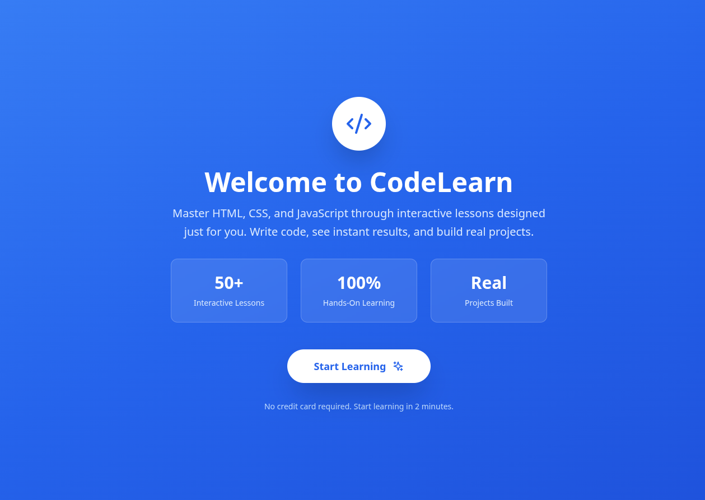

# Interactive Lesson Code Editor

> **Status:** MVP / Alpha  
> **License:** To be determined  
> **Contributions:** Not currently accepting contributions. Please check back in the future.

---

## Overview

**Interactive Lesson Code Editor** is the foundation for a next-generation adaptive coding education platform. Inspired by the best of Codecademy, freeCodeCamp, and hands-on learning, this project is designed to empower complete beginners and self-taught developers to learn HTML, CSS, JavaScript, and modern web development through interactive, personalized lessons.

This platform bridges the gap between users and AI coding tools by focusing on true coding mastery—not just code completion—with a three-panel live coding environment, gamification, immediate feedback, and learning path personalization.

---

## Key Features

- **Personalized Onboarding**  
  Assess your learning style, experience, and goals to create a custom learning path.
- **Three-Panel Interactive Environment**  
  Side-by-side lesson content, live code editor, and instant output preview.
- **Adaptive Learning Paths**  
  Progress from absolute beginner to advanced topics in web development.
- **Intelligent Feedback**  
  Real-time, context-aware feedback on code execution and mistakes.
- **Gamification & Progression**  
  Earn points, track streaks, unlock achievements, and visualize your journey.
- **Playground Mode**  
  Experiment, build, and share projects in a safe sandbox.

---

## Screenshots

Below are sample screenshots demonstrating the onboarding flow, learning environment, feedback system, and progression tracking.

### Onboarding Flow

*Welcome screen with instant start and highlights of interactive, hands-on learning.*

*Choose your preferred learning style: Visual, Auditory, or Hands-On.*

*Select your experience level: Beginner, Intermediate, or Advanced.*

*Set your project goals: Websites, Web Apps, or Games.*

### Personalized Path & Course Start

*Your learning path is customized based on your assessment.*

### Learning Environment

*Three-panel interface: lesson content, live preview, and interactive code editor.*

*Write code and see instant results side-by-side.*

### Feedback & Gamification

*Earn points and progress with instant feedback on lesson completion.*

### Progress Tracking

*Track your progress through lessons and unlock new content.*

### More Interactive Examples

*Guided lessons with practice exercises and immediate feedback on errors.*

*Helpful error messages guide you to fix mistakes and learn debugging skills.*

*Write code, run it, and see output instantly.*

---

## Core Philosophy

- **Learn by Doing:** Every lesson is interactive. Write code, see output, and solve challenges as you go.
- **Personalized for You:** The platform adapts to your background, goals, and learning style.
- **Supportive Feedback:** Mistakes are teaching moments, with helpful, non-judgmental guidance.
- **From Beginner to Builder:** Start with the basics, build real projects, and gain confidence step by step.

---

## Technology Stack

- **Frontend:** React.js/Next.js, Tailwind CSS, Monaco/CodeMirror Editor
- **Backend:** Node.js/Express (or Next.js API routes)
- **Database:** PostgreSQL (users, progress), MongoDB (content)
- **Code Execution:** Secure sandbox (Docker/Web Containers)
- **AI Integration:** Contextual feedback, adaptive lesson recommendation
- **Hosting:** Vercel, AWS, or similar

---

## Current Status

This repository is in an **MVP/Alpha** stage and not yet open to outside contributors.  
Licensing and contribution guidelines will be finalized prior to any public beta or release.

---

## License

**To be determined.**  
All rights reserved to the project owner. Please do not redistribute or reuse code from this repository until a license is published.

---

## Roadmap

- [ ] Complete MVP for HTML/CSS/JS beginner tracks
- [ ] Expand adaptive feedback and error handling
- [ ] Launch playground and project sharing features
- [ ] Add leaderboards, achievements, and more gamification
- [ ] Open for community feedback and eventual contributions

---

## Contact

Please watch this repository for updates, or check back as the platform evolves!

---

**EmpowerByDesign – Interactive Lesson Code Editor**  
Learn to code the way you learn best—with AI-powered guidance, hands-on practice, and a community that grows with you.
